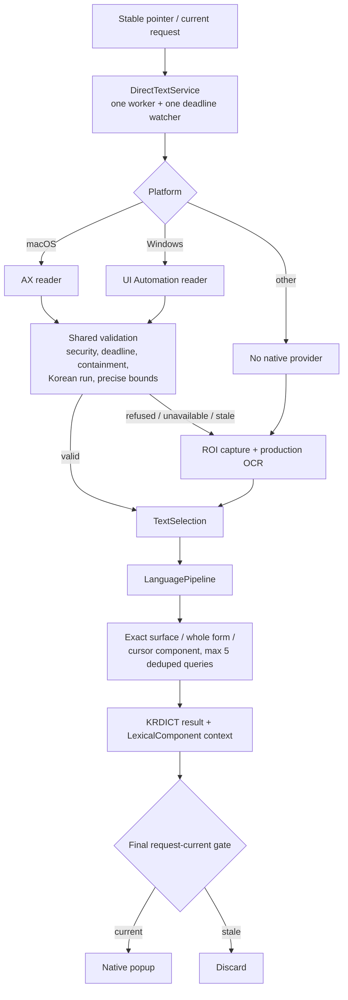
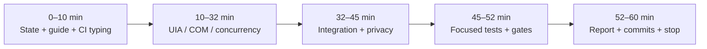

# Final branch review guide

> **Status (2026-09-22): executed.** This is the preserved review scaffolding
> for the final text-acquisition review. The review ran as `fabceb8..9b80ad4`
> (the Linux mypy failure described here was fixed locally in `fabceb8`, still
> to be confirmed by remote CI), and its outcome is
> `docs/execution/reports/final-text-acquisition-review-2026-09-22.md`. The
> follow-up correction bundle is recorded in
> `docs/execution/review-handoffs/final-correction-bundle-2026-09-22.md`.
> Statements below describe the branch as it stood before that review.

Orientation for the final time-boxed review of `visual/interface-update`.
This guide is a map, not a competing execution plan. `AGENTS.md`, the
architecture documents, and `docs/execution/05-execution-plan.md` remain
authoritative.

## Reviewer mission

Review the branch from `4f9547b` through `9962505` as one integrated product
change, with deepest attention on the unreviewed Windows UIA boundary and the
shared behavior it exercises. Fix the known Linux mypy failure and only cheap,
demonstrated defensive defects. Produce one final report at:

`docs/execution/reports/final-text-acquisition-review-2026-09-22.md`

The review is limited to about 60 minutes. Previous handoffs are evidence and
routing aids; they are not proof and should not be recopied into the report.

## Starting snapshot

| Item | Expected value |
|---|---|
| Branch | `visual/interface-update` |
| Base | `4f9547b` (`v0.5.3`, current `main` when the branch began) |
| Product review boundary | `9962505` |
| Branch commits | 22 |
| Diff size | 144 files, +38,058 / -1,733 |
| Final reviewed macOS boundary | `45a22a7` |
| Windows implementation | `73b7372` |
| Windows handoff | `9962505` |
| Unreviewed product boundary | Windows UIA plus its shared worker hooks |
| Known CI failure | Linux mypy cannot resolve optional `Foundation` / `objc` imports because their inline ignores name the wrong error code |

Verify this snapshot before relying on it. `HEAD` may contain one later
documentation-only commit that adds this guide and its execution prompt; that
is review scaffolding, not product scope. Otherwise, if history advanced, keep
`9962505` as the product baseline and include later commits explicitly.

## One-page evolution map

```mermaid
flowchart LR
    M["4f9547b<br/>v0.5.3 main"]
    UI["6c02d03–f9514d4<br/>Control Center + popup"]
    D["d66a361–9c4cfea<br/>Diagnostics, OCR correction,<br/>language seam, portability"]
    L["0ec5008–22bb4be<br/>Whole forms + dictionary hardening"]
    C["573b115<br/>Lexical components"]
    AX["c083d62<br/>macOS AX"]
    R1["1dbe8e8–45a22a7<br/>Mac reviews and corrections"]
    WP["456500e<br/>Windows execution plan"]
    UIA["73b7372<br/>Windows UIA"]
    WH["9962505<br/>Windows handoff"]
    FR["Final Sol review<br/>this run"]

    M --> UI --> D --> L --> C --> AX --> R1 --> WP --> UIA --> WH --> FR
```

The large `d66a361` commit is a historical consolidation of work that already
has wave-specific checkpoints and handoffs. Review it through those artifacts
and the current integration rather than trying to reconstruct its chronology
from one diff.

## Current runtime after the branch

Invariant: native acquisition can accelerate semantic text, but refusal must
always preserve the existing OCR path. Native text and OCR meet only at the
acquisition-neutral `TextSelection` / `LanguagePipeline` seam.

## Commit timeline

| Commit | Capability / reason | Durable evidence | Review state / final-review emphasis |
|---|---|---|---|
| `6c02d03` | Rebuilt the Control Center around the approved sidebar/page design, real bridge state, responsive layout, themes and capture controls. | `control-center-redesign-2026-09-17.md` | Previously handed off; check only integration and regressions. |
| `f9514d4` | Rebuilt the native dictionary popup: compact/expanded card, real KRDICT metadata, morphology, placement and retention. | `popup-redesign-2026-09-18.md` | Previously reviewed; inspect current component integration and retained bounds. |
| `d66a361` | Consolidated Waves 1–4: trace parity, capture/gate/cache/resolver evidence, memory-only Freeze and explicit Export, OCR corpus tooling, Vision 2× input correction, and the acquisition-neutral language seam. | Diagnostics, Wave 3 and Wave 4 checkpoints/handoffs | High-level invariant and privacy audit; do not re-run every historic experiment. |
| `9c4cfea` | Made retained-evidence tests portable without requiring `pynput` on Linux. | Test and CI history | Confirm no test-only runtime behavior leaked. |
| `0ec5008` | Preferred genuine whole-form dictionary entries and corrected homograph ordering. | Whole-form checkpoint/handoff | Recheck parity, cursor fallback, and query accounting. |
| `22bb4be` | Rejected wrong lemma substitutions such as `고소득층 → 고소득`; corrected evidence and ordering claims. | Post-bundle review outcome | Accepted ancestor; sample the hardened boundary. |
| `573b115` | Added `LexicalComponent`, contextual decomposition, bounded component glosses and the popup panel. | Mac campaign checkpoint/handoff | Public-contract, span, overlap, query-bound and presentation review. |
| `c083d62` | Added macOS AX direct-text acquisition through the shared coordinator. | Mac campaign handoff | Superseded by several reviewed hardening commits below. |
| `b0851a8` | Recorded Wave 7: no new OCR engine; current corpus is too small/synthetic to justify HanlyOCR. | `ocr-research-verdict-2026-09-21.md` | Verify conclusion remains proportionate and production stayed unchanged. |
| `ae3bccc` | Closed the original Mac Phase A campaign. | Mac campaign handoff | Historical boundary. |
| `1dbe8e8` | Hardened AX UTF-16 refusal, native deadline and acquisition trace labels. | Mac Phase B outcome | Later UTF-16 conversion replaced refusal; trace/deadline hardening remains. |
| `fced4e1` | Recorded Mac Phase B review outcome. | Mac handoff | Historical review record. |
| `981a718` | Moved native acquisition off the Qt thread, introduced `DirectTextService`, proper UTF-16 conversion and mixed-script narrowing. | Mac correction outcome | Core shared concurrency boundary; re-audit current version. |
| `64dd24d` | Restored useful span-faithful lexical decompositions while suppressing misleading ones. | Mac correction outcome | Verify max-five queries and documented form-versus-sense limits. |
| `abca3a9` | Recorded the human-requested corrections. | Mac checkpoint/handoff | Historical boundary. |
| `b31b4b3` | Stopped deadline-watcher CPU spin, kept delivery exceptions from killing the worker, and prevented callback self-join. | Focused delta outcome | High-risk race/lifecycle fix; inspect final service, not only tests. |
| `62e9624` | Recorded focused correction review. | Mac handoff | Accepted Mac concurrency boundary before precise bounds. |
| `d561667` | Requested exact `AXBoundsForRange` geometry for narrowed Korean text instead of retaining a whole mixed line. | Precise-bounds outcome | Verify fallback when exact geometry is unavailable. |
| `45a22a7` | Recorded final Mac retained-bounds evidence. | Mac handoff | Final reviewed Mac boundary. |
| `456500e` | Added the executable Windows Wave 6 plan. | `wave-6-windows-execution-prompt.md` | Planning only. |
| `73b7372` | Added the ctypes Windows UIA adapter, Windows composition branch, COM worker hooks and 77 tests. | Windows checkpoint/handoff | Primary unreviewed product change. Deep review required. |
| `9962505` | Recorded real Windows coverage, measurements, limitations and handoff. | Windows checkpoint/handoff | Review claims independently; baseline failures are not automatically dismissed. |

## Evidence routing

Read these artifacts for a question, not as a second full implementation log.

| Question | Best source |
|---|---|
| What is authoritative about workflow and review authority? | `docs/execution/05-execution-plan.md` |
| Why do tracing, Freeze and Export exist, and what is private? | `review-handoffs/text-acquisition-diagnostics-2026-09-20.md` |
| What real OCR failure selected the 2× Vision input change? | `review-handoffs/wave-3-vision-input-scale-2026-09-21.md` |
| Why can native text bypass OCR without duplicating language logic? | `review-handoffs/wave-4-language-seam-2026-09-21.md` |
| Why is `초대받다` not shown, and how are whole forms ranked? | `review-handoffs/whole-form-lookup-and-component-panel-2026-09-21.md` |
| What happened across component presentation and macOS AX? | `review-handoffs/mac-campaign-2026-09-21.md` |
| What exactly did Windows implement and measure? | `review-handoffs/wave-6-windows-2026-09-22.md` |
| What are the full Windows environment measurements? | `checkpoints/wave-6-windows-2026-09-22.md` |
| Why is no new OCR model shipping? | `reports/ocr-research-verdict-2026-09-21.md` |

## Code and test risk map

| Boundary | Production files | Strongest tests | Review question |
|---|---|---|---|
| Shared direct-text policy and concurrency | `hanly_app/text_acquisition.py` | `test_text_acquisition.py`, `test_text_acquisition_service.py`, `test_direct_text_routing.py` | Can any timeout, dispatcher, close, bind, release or supersession race lose fallback or publish stale work? |
| macOS native reader | `hanly_app/text_acquisition_ax.py` | `tests/native/macos/test_text_acquisition_units.py` | Are UTF-16 conversion, precise bounds, CF ownership and deadlines still correct after shared changes? |
| Windows native reader | `hanly_app/text_acquisition_uia.py` | `tests/native/windows/test_text_acquisition_uia.py` | Are COM ABI, lifetime, security, ranges, coordinates and refusal semantics correct beyond the measured apps? |
| Application routing | `composition.py`, `hover_lookup.py`, `lookup_controller.py`, `lookup_process.py` | direct-routing, hover and composition tests | Does a valid direct result avoid OCR and every current refusal reach OCR once? |
| Language selection | `hanly/language_pipeline.py`, `contracts.py` | whole-form, lexical-component and real KRDICT tests | Are primary entry, component evidence and max-five deduplicated queries consistent at every cursor? |
| Popup | `popup.py`, `qt_popup.py` | popup and native Qt tests | Does added context preserve placement, retention, compact/expanded behavior and privacy? |
| OCR diagnostics | `vision_provider.py`, `easyocr_provider.py`, `benchmarks/dev/` | Vision/EasyOCR and benchmark tests | Are live production evidence and staged replay still explicitly distinct? |
| Packaging/platform isolation | package metadata, spec, platform factories | packaging, import and suite-routing tests | Do optional platform libraries stay off unsupported hosts and inside the correct artifact? |

## Accepted facts to sample, not exhaustively rediscover

- Traced and untraced lookup parity was independently demonstrated.
- Freeze is memory-only; only explicit Export writes private artifacts.
- The real Vision misses changed from failure at scale 1 to stable success at
  scale 2 on the same exported pixels.
- `TextSelection` and `LanguagePipeline` keep platform acquisition out of the
  reusable engine.
- `초대받다` is absent from KRDICT; `초대받았어요` therefore correctly falls
  back to a cursor-selected component rather than an invented translation.
- Dictionary queries are deduplicated and contractually bounded at five.
- The final Mac direct path uses a bounded service, proper UTF-16 conversion,
  mixed-script narrowing, and exact retained geometry.
- Wave 7 made no production OCR/backend/package change.

If code contradicts any fact, the code wins as evidence and the contradiction
is a finding.

## Open questions that deserve the hour

1. Is the new UIA binding ABI-correct on supported Windows x86-64, including
   signed `HRESULT` handling, `RPC_E_CHANGED_MODE`, VARIANT/SAFEARRAY/BSTR
   cleanup, interface releases and vtable slots?
2. Do `bind_worker()` / `release_worker()` preserve the reviewed service
   lifecycle when binding fails, delivery raises, or close races teardown?
3. Can the 40 ms common deadline and 50 ms minimum UIA timeout delay a pending
   current request beyond acceptable fallback behavior?
4. Can the dual code-point / UTF-16 candidate strategy select a wrong repeated
   substring even though returned text matches?
5. Are password and higher-integrity refusals decided before any sensitive
   pattern/text read?
6. Do UIA, Qt, pynput and capture really share physical coordinates under the
   tested DPI mode, and are untested mixed-DPI claims bounded honestly?
7. Do Linux, Windows and macOS imports/type checking remain isolated after the
   optional Vision and UIA additions?
8. Are the Windows local gate failures environment-only, test-infrastructure
   defects, or evidence that OCR fallback/packaging remains unproved?
9. Did any trace, checkpoint, corpus or commit persist real screen or
   accessibility text outside explicit Export?
10. Is the branch merge-ready after the Linux mypy correction, or does a
    finding require a separate implementation run?

## Known CI correction

Ubuntu CI at `9962505` reports four mypy errors in `vision_provider.py` because
optional macOS modules `Foundation` and `objc` are absent and the inline ignores
name `import-untyped` rather than `import-not-found`. Fix this narrowly. Do not
turn on global missing-import suppression; preserve `warn_unused_ignores`.

## Review checkpoints for a 60-minute run

Operational checkpoints:

- **T+10:** starting state and CI typing correction understood; commit only if
  the narrow fix is verified.
- **T+32:** UIA/COM and shared concurrency verdict drafted; no new broad
  investigation after this point unless it is P0/P1.
- **T+45:** architecture, language, privacy and packaging disposition captured.
- **T+50:** stop opening new questions; ensure the report file exists.
- **T+60:** stop and report uncertainty honestly.

## Final report decision model

Use one verdict:

- **Accept** — no merge-blocking finding and required gates/evidence are green.
- **Accept with hardening** — only cheap demonstrated fixes were applied and
  the resulting state is merge-ready after CI.
- **Changes required** — a correctness, privacy, lifecycle, fallback, package,
  or CI problem needs another implementation run.
- **Blocked by missing evidence** — the code may be sound, but a required real
  platform claim cannot be established.

Every unresolved finding needs severity, evidence, product impact, likely
files, smallest proposed fix, and a revisit trigger. Separate unavailable
hardware from code defects and from test-infrastructure defects.

## Guardrails

- No push, merge, rebase, amend or squash.
- No DOM/browser extension, PaddleOCR, new OCR provider, semantic translation,
  popup redesign, or speculative DPI transform.
- No persistence of real user content.
- No second report or duplicate checkpoint. Draft the final report early and
  use it as the review ledger.
- A prior green test or review is evidence, not proof; a baseline failure is
  context, not automatic dismissal.
